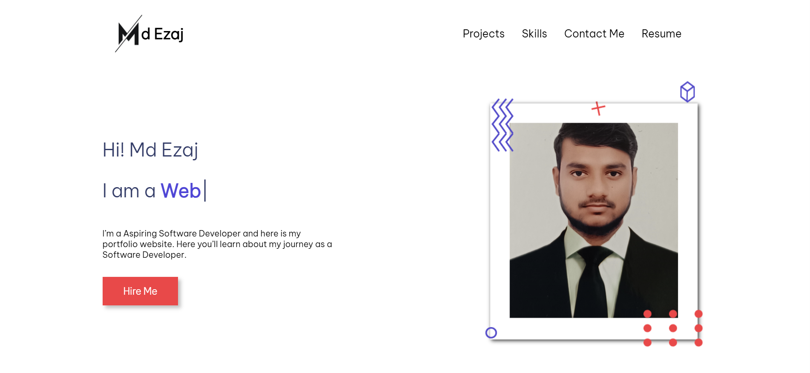
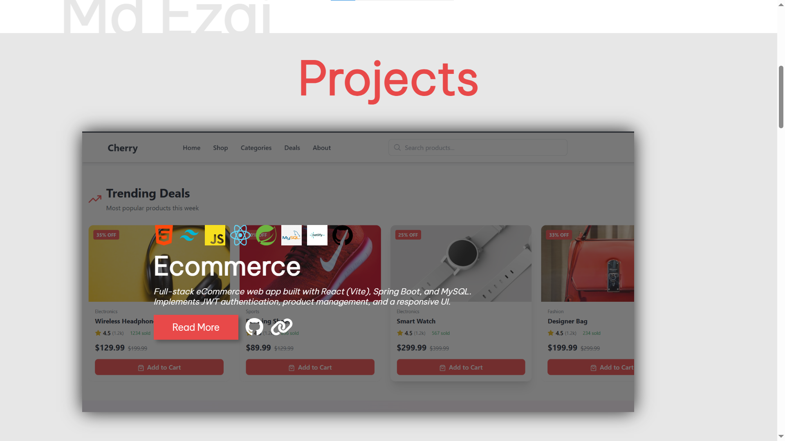
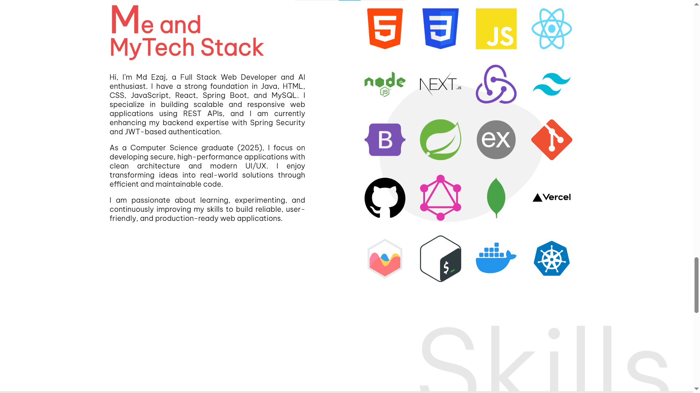

# 💼 Personal Portfolio

A modern and responsive personal portfolio website built using **HTML, CSS, and JavaScript**. It showcases my projects, technical skills, and provides an easy way to connect with me.

---

## 🚀 Live Demo

👉 https://ezaj-portfolio.netlify.app/

---

## 📸 Screenshots

### 🏠 Home Section



### 💻 Projects Section



### 🛠 Skills Section



---

## 🛠 Tech Stack

* HTML5
* CSS3
* JavaScript

---

## ✨ Features

* Responsive design (mobile-friendly)
* Smooth scrolling navigation
* Project showcase section
* Skills section
* Contact section
* Resume view/download option

---

## 📂 Project Structure

```
portfolio/
├── images/
├── projects/
├── stack/
├── userAsset/
├── index.html
├── styles.css
└── js.js
```

---

## ⚙️ Setup & Usage

1. Clone the repository:

```bash
git clone https://github.com/mdezaj/portfolio.git
```

2. Open `index.html` in your browser

---

## 📬 Contact

* LinkedIn: https://www.linkedin.com/in/ezaj1/
* GitHub: https://github.com/mdezajansari
* Email: [mdezajansari123@gmail.com](mailto:mdezajansari123@gmail.com)

---

## ⭐ Acknowledgements

Inspired by modern developer portfolios and UI best practices.
